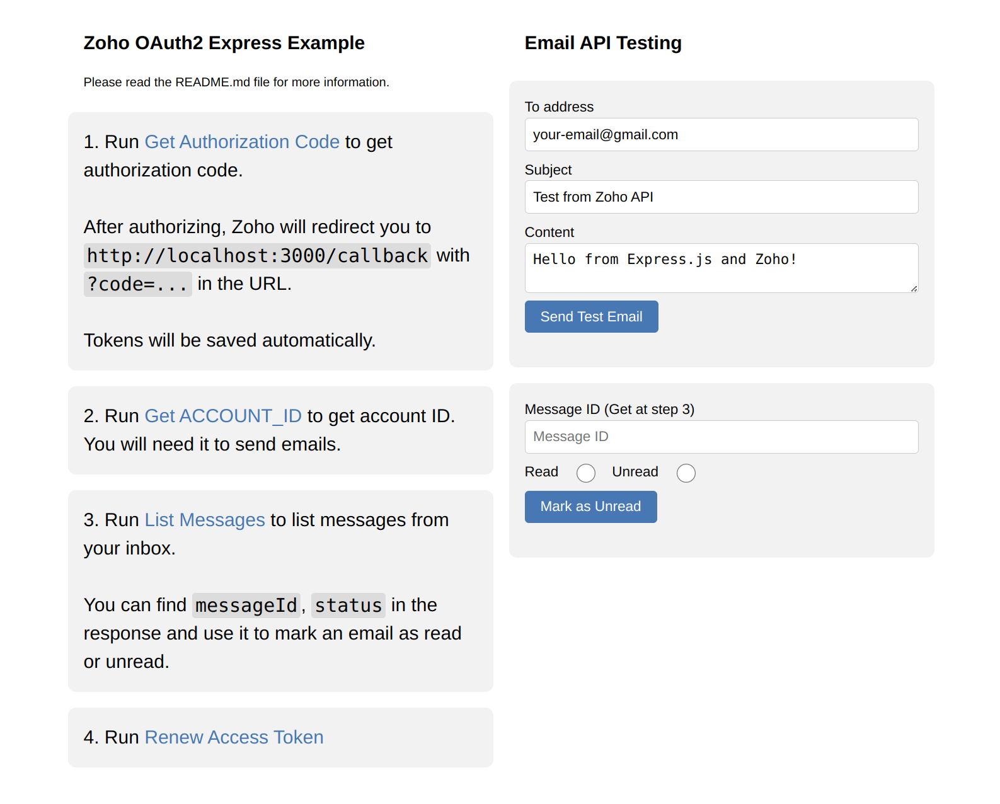

# Zoho Mail API Integration with Node.js

A sample Express.js application demonstrating integration with Zoho Mail API using OAuth 2.0 authentication. This app provides endpoints for sending emails, listing messages, marking emails as read/unread, and managing OAuth tokens.



## Features

- OAuth 2.0 authentication with Zoho Mail
- Send test emails
- List messages from a specific folder
- Mark emails as read/unread
- Auto token refresh functionality
- Simple web interface for testing

## Prerequisites

1. Node.js installed on your system
2. A Zoho Mail account
3. A registered application in [Zoho Developer Console](https://accounts.zoho.com/developerconsole)
   - Select "Server-Based Applications" when registering
   - Configure redirect URI as `http://localhost:3000/callback`

### Getting CLIENT_ID and CLIENT_SECRET

1. Go to [Zoho Developer Console](https://accounts.zoho.com/developerconsole)
2. Click on "Add Client" to create a new application
3. Choose "Server-based Applications" as the client type
4. Fill in the required details:
   - Client Name: Your application name (e.g., "Email Integration")
   - Homepage URL: You can use **`http://localhost:3000`** for testing
   - Authorized Redirect URIs: Add **`http://localhost:3000/callback`**
   
5. After creating the application, you'll receive:
   - Client ID (e.g., `1000.XXXXXXXXXXXXXXXXXXXXXXXXXXXX`)
   - Client Secret (e.g., `abcd1234efgh5678ijkl9012mnop3456qrst`)
6. Copy these credentials and update them in your `.env` file or directly in `index.js`

> **Important**: Zoho fully supports using `localhost` for development and testing. You don't need a production domain to start developing. 
> For more details about OAuth2 implementation, refer to the [Zoho Mail API Documentation](https://www.zoho.com/mail/help/api/using-oauth-2.html).

### OAuth Scopes

The application uses Zoho Mail API scopes for reading and managing emails. The scopes are configured in your `.env` file. See the [Zoho Mail API Documentation](https://www.zoho.com/mail/help/api/post-send-an-email.html) under "OAuth Scope" for available options.

## Installation

Install dependencies:
```bash
pnpm install
```
Start the server:
```bash
pnpm run dev
```

## Usage

1. Open your browser and navigate to [http://localhost:3000](http://localhost:3000)

2. Follow the authentication flow:
   - Click "Get Authorization Code" link
   - Log in to your Zoho account and authorize the application
   - The app will automatically save the tokens in `zoho_tokens.json`

3. Get your ACCOUNT_ID:
   - Call the `/get-account-id` endpoint
   - In the JSON response, find the account that matches your email address
   - Copy the `accountId` value (e.g., `6702887000000008002`)
   - Add it to your `.env` file:
     ```
     ACCOUNT_ID=your_account_id_here
     ```
   > **Note**: The ACCOUNT_ID is required for most Zoho Mail API operations

4. Test the integration:
   - Click "Send Test Email" to verify the setup

## API Endpoints

### Authentication and Email Operations

| Method | Endpoint | Description | Parameters |
|--------|----------|-------------|------------|
| GET | `/` | Home page with instructions and auth links | None |
| GET | `/callback` | OAuth2 callback endpoint to exchange authorization code for tokens | `code` (string): Authorization code from Zoho |
| GET | `/send-test-email` | Send a test email using Zoho Mail API | - `toAddress` (string, optional): Recipient email<br>- `subject` (string, optional): Email subject<br>- `content` (string, optional): Email content |
| GET | `/get-account-id` | Get the Zoho Mail account ID | None |
| GET | `/mark-email` | Mark an email as read or unread | - `messageId` (string): Email ID<br>- `read` (string): 'true' or 'false' |
| GET | `/list-messages` | List inbox email messages | None |
| GET | `/renew-access-token` | Renew the access token | None |

## Token Management

- Tokens are automatically saved to `zoho_tokens.json`
- Access tokens expire after 1 hour
- Use the `/renew-access-token` endpoint to refresh expired tokens
- The refresh token is used automatically when renewing access tokens

## Security Notes

- Never commit your `CLIENT_ID`, `CLIENT_SECRET`, or `zoho_tokens.json` to version control
- Use environment variables for sensitive data in production
- Keep your refresh token secure

## Error Handling

The application includes basic error handling for:
- Missing or invalid tokens
- Failed API requests
- Invalid parameters
- Token refresh failures

## Contributing

Feel free to submit issues and enhancement requests!
